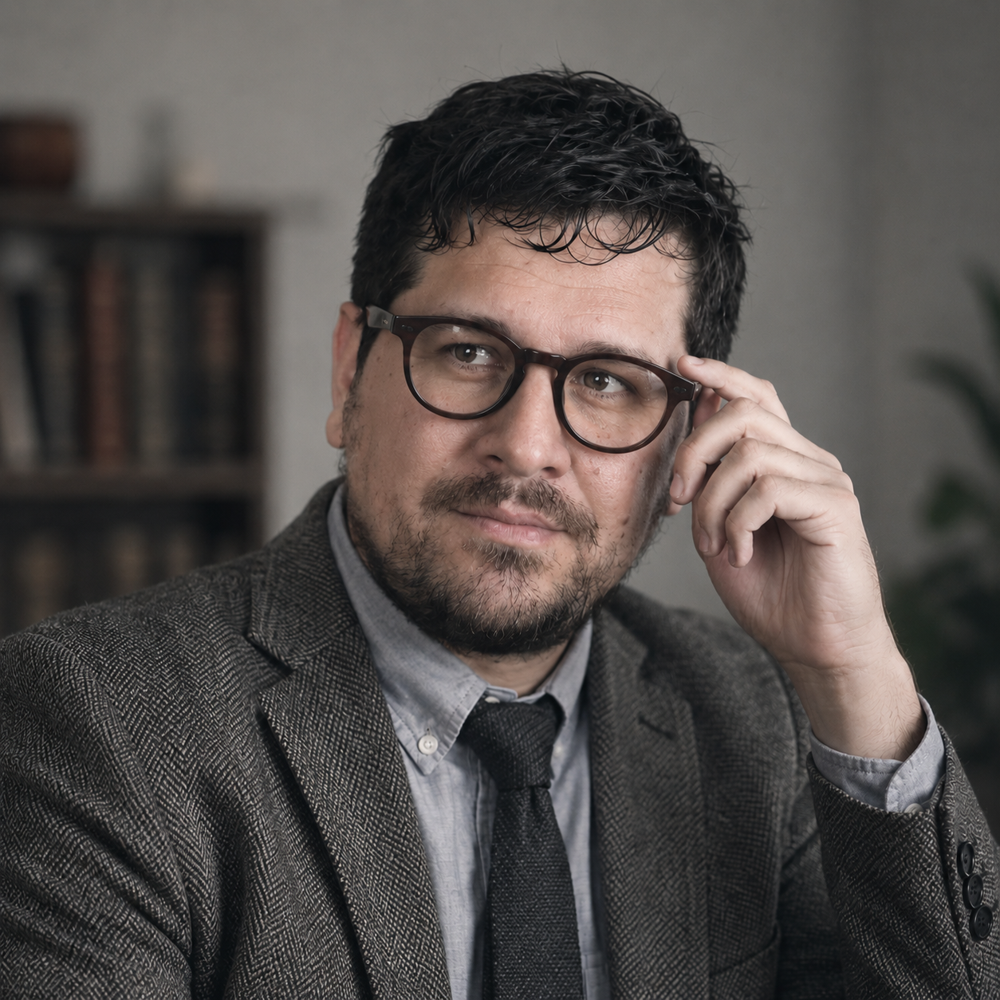

## Joaquín Medina - Graduado en psicología, máster en envejecimientoWeb Developer based in Estonia

## Sobre mí

Soy Joaquín Medina, psicólogo especializado en intervención psicosocial, arteterapia y desarrollo de proyectos comunitarios basados en las artes escénicas y la producción audiovisual.

Mi trabajo se centra en el diseño e implementación de programas orientados a mejorar el bienestar emocional, la participación social y la calidad de vida de las personas mediante procesos creativos y dinámicas grupales.

A lo largo de mi trayectoria he desarrollado proyectos vinculados a la discapacidad, el envejecimiento saludable, la integración comunitaria y la dinamización cultural, colaborando con ayuntamientos, asociaciones y entidades sociales.

La producción audiovisual forma parte fundamental de mi metodología de trabajo, tanto como herramienta expresiva y artística como medio de participación, documentación e intervención social.

## Áreas de interés

- Intervención psicosocial
- Arteterapia y artes escénicas
- Envejecimiento saludable
- Discapacidad e inclusión social
- Producción audiovisual
- Participación comunitaria
- Salud mental y creatividad